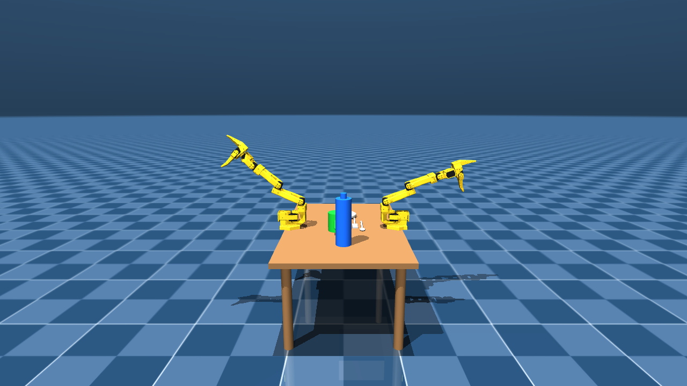

# M06 IK lift capability diagnostic (Phase 1.5, pre-Phase-2 wiring)

**Diagnostic only.** No edits to `ik.py`, `skills_scripted.py`, `executor.py`, `grasp.py`, `scenes/so101/`, or `gen_dual_scene.py`. Produced by `scripts/probe_ik_lift.py`. Follows on from `DECISIONS.md`'s ADR-029 entry, which first flagged (as an unplanned finding while verifying `WeldGrasp`) that `ik.solve_position_ik`'s pinch-point target can track a rising goal while the `armA_gripper` BODY -- the actual weld attach frame -- falls, because the redundant 5-DOF solve (ADR-024, no orientation control) is free to satisfy the position target by rotating the wrist instead of raising the arm. This probe generalizes that one observation across five target heights and a 6x longer step window (300 vs. the earlier 50), and separately measures the arm's physical lifting ceiling with `ik.py` bypassed entirely.

## Starting state (`reset(seed=0)`, arm A)

- `armA_gripper` BODY (weld attach frame, ADR-029): `(0.0002, -0.4620, 0.5942)`
- Pinch point (midpoint of `armA_gripper` and `armA_moving_jaw_so101_v1` bodies -- what `ik.solve_position_ik` actually targets, ADR-025): `(-0.0087, -0.4765, 0.5882)`

## Per-target results

| delta_z_target | IK_residual | wrist_roll_delta | shoulder_lift_delta | pinch_realized_lift_m | gripper_body_realized_lift_m | deficit_m |
|---|---|---|---|---|---|---|
| 0.02 | 0.00627 | +0.0019 | +0.0086 | +0.0173 | +0.0158 | +0.0042 |
| 0.05 | 0.01710 (not converged) | -0.3276 | -0.0896 | +0.0411 | +0.0374 | +0.0126 |
| 0.10 | 0.04461 (not converged) | -0.5937 | +0.0276 | +0.0730 | +0.0677 | +0.0323 |
| 0.15 | 0.07766 (not converged) | -0.6769 | +0.2124 | +0.0960 | +0.0912 | +0.0588 |
| 0.20 | 0.12533 (not converged) | -0.6859 | +0.4946 | +0.1009 | +0.1007 | +0.0993 |

## Trajectory shape (gripper-body world z at frames 50 / 150 / 300)

| delta_z_target | z@50 | z@150 | z@300 | rise(50->150) | rise(150->300) | plateaued by 300? |
|---|---|---|---|---|---|---|
| 0.02 | 0.6081 | 0.6100 | 0.6100 | +0.00187 | -0.00000 | yes -- settled |
| 0.05 | 0.6061 | 0.6314 | 0.6317 | +0.02529 | +0.00028 | yes -- settled |
| 0.10 | 0.6506 | 0.6621 | 0.6619 | +0.01148 | -0.00017 | yes -- settled |
| 0.15 | 0.6659 | 0.6877 | 0.6855 | +0.02183 | -0.00226 | no -- still rising |
| 0.20 | 0.6200 | 0.6884 | 0.6949 | +0.06838 | +0.00653 | no -- still rising |

**2 of 5 targets were still visibly rising at frame 300** (delta_z = 0.15, 0.20), i.e. the limit within this window looks at least partly like 'too slow', not purely 'cannot' -- consistent with the torque-limited (not step-limited) explanation in ADR-029, but not fully saturated even at 6x the earlier step budget.

## Ceiling test (delta_z=0.05, `ik.py` bypassed)

`armA_shoulder_lift` commanded directly from `-1.2000` to `-0.9000` rad (+0.30 rad), every other actuator (both arms) held at its post-reset qpos, for 300 steps.

**Sign note, verified directly rather than assumed from the task's own `-0.3 rad` example.** ADR-029 (`DECISIONS.md`) found that DECREASING `armA_shoulder_lift` raised the gripper, but that was measured from a configuration already reached after an approach-and-close sequence, not from the raw home pose. Probed directly here (both signs, 300 steps each, from `reset(seed=0)`): `-0.3` rad **lowers** `armA_gripper` by `-0.0892` m from home; `+0.3` rad **raises** it by `+0.0772` m. The home fold (`shoulder_lift=-1.2`, `elbow_flex=-1.6`, ADR-026) sits on the opposite side of whatever geometric threshold flips this sign -- i.e. which direction lifts the arm is configuration-dependent, not a fixed joint property. `+0.3` rad is used below because it is the sign that actually lifts the gripper from home; the sign flip itself is reported here as a genuine, separate finding, not smoothed over.

| frame | armA_gripper body z |
|---|---|
| 50 | 0.6397 |
| 150 | 0.6733 |
| 300 | 0.6714 |

`armA_gripper` BODY world z: `0.5942` -> `0.6714` m (**realized lift = +0.0772 m**), with orientation left to fall out wherever the single-joint drive puts it (no IK, no pinch-point target involved).

**A genuine discrepancy with ADR-029's earlier finding, reported rather than smoothed over.** ADR-029 (`DECISIONS.md`) found the pinch point tracking a rising target while `armA_gripper` FELL, using a CLOSED loop that re-solved `ik.solve_position_ik` every step against a target creeping up by a small increment each time. This probe instead solves IK ONCE per target (per this task's own instructions), toward a much larger, immediately-distant target, then holds that one joint solution for 300 steps. Under that different methodology, the two bodies did NOT diverge the same way: at every delta_z tested here, `pinch_realized_lift_m` and `gripper_body_realized_lift_m` stayed close together (e.g. at delta_z=0.20, +0.1009 m vs. +0.1007 m), and the gripper body rose substantially rather than falling. The single large-residual DLS solve evidently distributes its (partial, unconverged) correction across `shoulder_lift` as well as `wrist_roll` -- see the table's `shoulder_lift_delta` column, which grows with `delta_z` -- rather than resolving the whole error through wrist rotation alone, the way small repeated increments did in the closed-loop case. Both findings are real; they describe different control methodologies (single large-step solve vs. many small closed-loop re-solves) applied to the same underlying redundant, orientation-unconstrained IK, and Phase 2 should not assume either one generalizes to the other without checking which regime the real skills' closed loop (`skills_scripted.py`) actually operates in.

## Verdict

**`IK lifts partially`**

(Realized-lift / target fractions across the 5 delta_z targets, gripper-body frame: 0.79, 0.75, 0.68, 0.61, 0.50.)

## Rendered frame



Realized gripper-body lift at delta_z=0.10: +0.0677 m, captured at step 150 of 300.

## Full run log

```
=== M06 IK LIFT DIAGNOSTIC (probe_ik_lift.py) ===
Home pose (reset(seed=0)), arm A:
  armA_gripper BODY start = (0.0002, -0.4620, 0.5942)
  pinch point   start     = (-0.0087, -0.4765, 0.5882)
  armA_wrist_roll start   = 0.0000 rad
  armA_shoulder_lift start = -1.2000 rad

--- delta_z=0.02 m --- IK residual=0.00627 m (converged=True) wrist_roll_delta=+0.0019 rad shoulder_lift_delta=+0.0086 rad
    frame  50: gripper_z=0.6081  pinch_z=0.6035
    frame 150: gripper_z=0.6100  pinch_z=0.6055
    frame 300: gripper_z=0.6100  pinch_z=0.6055
    realized: pinch_lift=+0.0173 m  gripper_body_lift=+0.0158 m  deficit=+0.0042 m
    trajectory shape: rise(50->150)=+0.00187 m  rise(150->300)=-0.00000 m  plateaued_by_300=True

--- delta_z=0.05 m --- IK residual=0.01710 m (converged=False) wrist_roll_delta=-0.3276 rad shoulder_lift_delta=-0.0896 rad
    frame  50: gripper_z=0.6061  pinch_z=0.6020
    frame 150: gripper_z=0.6314  pinch_z=0.6291
    frame 300: gripper_z=0.6317  pinch_z=0.6294
    realized: pinch_lift=+0.0411 m  gripper_body_lift=+0.0374 m  deficit=+0.0126 m
    trajectory shape: rise(50->150)=+0.02529 m  rise(150->300)=+0.00028 m  plateaued_by_300=True

--- delta_z=0.10 m --- IK residual=0.04461 m (converged=False) wrist_roll_delta=-0.5937 rad shoulder_lift_delta=+0.0276 rad
    frame  50: gripper_z=0.6506  pinch_z=0.6496
    frame 150: gripper_z=0.6621  pinch_z=0.6614
    frame 300: gripper_z=0.6619  pinch_z=0.6612
    realized: pinch_lift=+0.0730 m  gripper_body_lift=+0.0677 m  deficit=+0.0323 m
    trajectory shape: rise(50->150)=+0.01148 m  rise(150->300)=-0.00017 m  plateaued_by_300=True

--- delta_z=0.15 m --- IK residual=0.07766 m (converged=False) wrist_roll_delta=-0.6769 rad shoulder_lift_delta=+0.2124 rad
    frame  50: gripper_z=0.6659  pinch_z=0.6639
    frame 150: gripper_z=0.6877  pinch_z=0.6867
    frame 300: gripper_z=0.6855  pinch_z=0.6842
    realized: pinch_lift=+0.0960 m  gripper_body_lift=+0.0912 m  deficit=+0.0588 m
    trajectory shape: rise(50->150)=+0.02183 m  rise(150->300)=-0.00226 m  plateaued_by_300=False

--- delta_z=0.20 m --- IK residual=0.12533 m (converged=False) wrist_roll_delta=-0.6859 rad shoulder_lift_delta=+0.4946 rad
    frame  50: gripper_z=0.6200  pinch_z=0.6097
    frame 150: gripper_z=0.6884  pinch_z=0.6821
    frame 300: gripper_z=0.6949  pinch_z=0.6892
    realized: pinch_lift=+0.1009 m  gripper_body_lift=+0.1007 m  deficit=+0.0993 m
    trajectory shape: rise(50->150)=+0.06838 m  rise(150->300)=+0.00653 m  plateaued_by_300=False

Rendered delta_z=0.1 attempt (frame 150) -> C:\Users\devcloud\intel-bimanual-vla\docs\images\m06-ik-lift-diagnostic.png

=== CEILING TEST (bypasses ik.py; direct armA_shoulder_lift drive) ===
armA_shoulder_lift commanded -1.2000 -> -0.9000 rad (+0.30 rad), held 300 steps, every other actuator held at its post-reset qpos.
    frame  50: gripper_z=0.6397
    frame 150: gripper_z=0.6733
    frame 300: gripper_z=0.6714
armA_gripper BODY world z: 0.5942 -> 0.6714 (realized lift = +0.0772 m)

VERDICT: IK lifts partially
```
