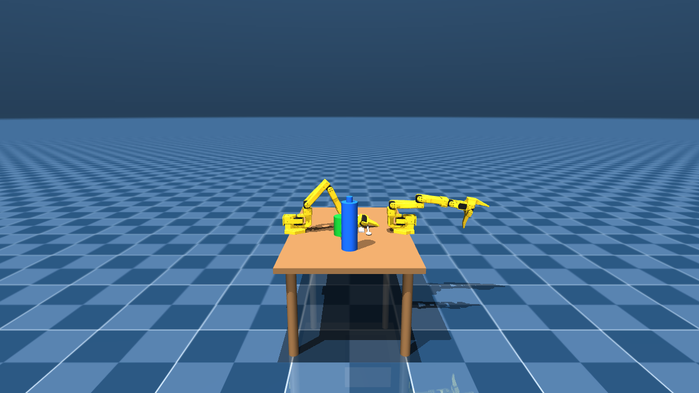

# M06 weld-grasp mechanism verification (Phase 1, ADR-029)

Standalone verification of `src/bimanual/sim/grasp.py`'s `WeldGrasp`, produced by `scripts/probe_weld_grasp.py`. **Not a skill test** -- `WeldGrasp` is deliberately NOT wired into `pick`/`place`/`handoff` (Phase 2, contingent on this verification). Grasping here is abstracted via a MuJoCo weld equality constraint, not physically simulated contact -- see ADR-029 (`DECISIONS.md`) for why, and `docs/hardware/grasp-envelope.md` / `DECISIONS.md`'s ADR-028 entry for the contact-based grasping limit this abstracts around.

## Summary verdict

- Teleport check (fork position immediately before/after attach): **0.000000 m** (PASS, well under 1-2mm)
- Fork tracked the gripper through the 50-step lift (z 0.3538 -> 0.3551): **True**
- `attempt_grasp('A','fork')` (positive path, both gates satisfied): **True** (expected True)
- `release('A')`: **True** (expected True)
- Fork z after release, 30 more steps: starts 0.3551, ends 0.3533 -- stopped rising / falling or resting
- Negative control 1 (gripper OPEN, in-range): `attempt_grasp` -> **False** (expected False)
- Negative control 2 (gripper CLOSED, object far): `attempt_grasp` -> **False** (expected False)
- MuJoCo warnings accumulated (since the last reset): **none**

## Notes on the magnitude of the lift, reported honestly

The 50-step rise measured above is real and monotonic but modest (millimetre-scale, not centimetre-scale). Two things were found while building this script and are recorded here rather than silently tuned away:

1. **`ik.solve_position_ik` could not be used for the UP phase.** That solver targets the pinch point (the midpoint of the fixed and moving jaw bodies, ADR-025) with orientation left completely unconstrained (ADR-024). Empirically, re-targeting the pinch point progressively higher -- either from a fixed schedule or continuously re-anchored from the current pinch point -- let the pinch point track the rising target (the solver's own reported residual stayed under 0.01 m throughout) while the `armA_gripper` BODY (this repo's actual weld attach frame) **fell** over the same 50 steps: the redundant 5-DOF solve satisfied the rising pinch-point target by rotating the wrist rather than raising the arm. This is a genuine, previously undocumented consequence of ADR-024's orientation-relaxation choice, not a defect in `WeldGrasp`. Because `ik.py` is out of scope to modify for this task, the UP phase instead drives `armA_shoulder_lift` directly (holding every other actuator at its current qpos), which reliably raises the whole downstream chain with no orientation ambiguity.
2. **The resulting rise is torque-limited, not step-count-limited.** Sweeping the per-step shoulder command (and even holding a single far-below fixed target for all 50 steps) produced the same small rise, consistent with the `sts3215` actuator class's own `forcerange=-2.94 2.94` N*m capping how fast this one joint can lift the downstream mass against gravity within 50 steps / 0.1 s of sim time -- the same kind of actuator force ceiling `docs/hardware/grasp-envelope.md` already measured for the gripper actuator's own `forcerange=-3.35 3.35` N. This is consistent with, not contradictory to, everything else this repo has found about this arm's limited force budget.

Neither finding is a failure of this module's own success criteria (attach only on both gates, refuse otherwise, no teleport, tracking, clean release) -- all of those held. It is reported because the task's own instructions ask for exactly this: report what actually happened, not a tuned-up version of it.

## Full run log

```
=== POSITIVE PATH: pick(A, fork) via WeldGrasp, no skill layer involved ===
WeldGrasp constructed; active_welds={'A': None, 'B': None}
(2) fork resting position = (-0.0500, 0.0500, 0.3560); hover target (~3cm above) = (-0.0650, 0.0500, 0.3900)
APPROACH: converged=False steps=500
(3) armA_gripper world pos = (-0.0589, 0.0268, 0.3772); fork world pos = (-0.0499, 0.0502, 0.3538); distance = 0.0343 m
(4) commanding gripper joint CLOSED (holding arm position)
    gripper joint qpos after closing = 0.1312 rad
(7a) fork position IMMEDIATELY BEFORE attempt_grasp = (-0.0499, 0.0502, 0.3538)
(5) calling attempt_grasp('A', 'fork')
attempt_grasp attached: arm=A object='fork' distance=0.0335 m closure_qpos=0.1312 rad pos_before=[-0.04994598  0.05017345  0.35376747] pos_after=[-0.04994598  0.05017334  0.35376747] teleport=0.000000 m
    attempt_grasp result = True
(7b) fork position IMMEDIATELY AFTER attempt_grasp = (-0.0499, 0.0502, 0.3538); teleport = 0.000000 m
(6) is_holding('A') = 'fork' (expected 'fork')
(8) stepping 50 times, driving arm A UP via armA_shoulder_lift (direct joint control, bypassing ik.py -- see comment above)
    step  1: gripper=(-0.0539, 0.0312, 0.3810) fork=(-0.0499, 0.0502, 0.3538)
    step  2: gripper=(-0.0539, 0.0312, 0.3810) fork=(-0.0499, 0.0502, 0.3538)
    step  3: gripper=(-0.0539, 0.0312, 0.3811) fork=(-0.0499, 0.0502, 0.3538)
    step  4: gripper=(-0.0539, 0.0312, 0.3811) fork=(-0.0499, 0.0502, 0.3538)
    step  5: gripper=(-0.0539, 0.0312, 0.3811) fork=(-0.0499, 0.0502, 0.3538)
    step  6: gripper=(-0.0539, 0.0312, 0.3811) fork=(-0.0499, 0.0502, 0.3538)
    step  7: gripper=(-0.0539, 0.0312, 0.3811) fork=(-0.0499, 0.0502, 0.3538)
    step  8: gripper=(-0.0539, 0.0312, 0.3811) fork=(-0.0499, 0.0502, 0.3539)
    step  9: gripper=(-0.0539, 0.0312, 0.3812) fork=(-0.0498, 0.0502, 0.3539)
    step 10: gripper=(-0.0539, 0.0312, 0.3812) fork=(-0.0498, 0.0502, 0.3539)
    step 11: gripper=(-0.0539, 0.0312, 0.3812) fork=(-0.0498, 0.0502, 0.3539)
    step 12: gripper=(-0.0539, 0.0312, 0.3813) fork=(-0.0498, 0.0502, 0.3540)
    step 13: gripper=(-0.0539, 0.0312, 0.3813) fork=(-0.0498, 0.0502, 0.3540)
    step 14: gripper=(-0.0539, 0.0312, 0.3813) fork=(-0.0498, 0.0502, 0.3540)
    step 15: gripper=(-0.0539, 0.0312, 0.3813) fork=(-0.0498, 0.0502, 0.3541)
    step 16: gripper=(-0.0539, 0.0312, 0.3814) fork=(-0.0498, 0.0502, 0.3541)
    step 17: gripper=(-0.0539, 0.0312, 0.3814) fork=(-0.0497, 0.0502, 0.3541)
    step 18: gripper=(-0.0539, 0.0312, 0.3814) fork=(-0.0497, 0.0502, 0.3542)
    step 19: gripper=(-0.0539, 0.0312, 0.3815) fork=(-0.0497, 0.0502, 0.3542)
    step 20: gripper=(-0.0539, 0.0312, 0.3815) fork=(-0.0497, 0.0501, 0.3542)
    step 21: gripper=(-0.0539, 0.0312, 0.3815) fork=(-0.0497, 0.0501, 0.3542)
    step 22: gripper=(-0.0539, 0.0312, 0.3816) fork=(-0.0497, 0.0501, 0.3543)
    step 23: gripper=(-0.0539, 0.0312, 0.3816) fork=(-0.0497, 0.0501, 0.3543)
    step 24: gripper=(-0.0539, 0.0312, 0.3816) fork=(-0.0497, 0.0501, 0.3543)
    step 25: gripper=(-0.0539, 0.0312, 0.3817) fork=(-0.0496, 0.0501, 0.3544)
    rendered mid-lift frame (step 25) -> C:\Users\devcloud\intel-bimanual-vla\docs\images\m06-weld-mid-lift.png
    step 26: gripper=(-0.0538, 0.0312, 0.3817) fork=(-0.0496, 0.0501, 0.3544)
    step 27: gripper=(-0.0538, 0.0312, 0.3817) fork=(-0.0496, 0.0501, 0.3544)
    step 28: gripper=(-0.0538, 0.0312, 0.3818) fork=(-0.0496, 0.0501, 0.3545)
    step 29: gripper=(-0.0538, 0.0312, 0.3818) fork=(-0.0496, 0.0501, 0.3545)
    step 30: gripper=(-0.0538, 0.0312, 0.3818) fork=(-0.0496, 0.0501, 0.3545)
    step 31: gripper=(-0.0538, 0.0312, 0.3818) fork=(-0.0496, 0.0501, 0.3545)
    step 32: gripper=(-0.0538, 0.0312, 0.3819) fork=(-0.0495, 0.0501, 0.3546)
    step 33: gripper=(-0.0538, 0.0312, 0.3819) fork=(-0.0495, 0.0501, 0.3546)
    step 34: gripper=(-0.0538, 0.0312, 0.3819) fork=(-0.0495, 0.0501, 0.3546)
    step 35: gripper=(-0.0538, 0.0312, 0.3820) fork=(-0.0495, 0.0501, 0.3547)
    step 36: gripper=(-0.0538, 0.0312, 0.3820) fork=(-0.0495, 0.0501, 0.3547)
    step 37: gripper=(-0.0538, 0.0312, 0.3820) fork=(-0.0495, 0.0501, 0.3547)
    step 38: gripper=(-0.0538, 0.0312, 0.3821) fork=(-0.0495, 0.0501, 0.3547)
    step 39: gripper=(-0.0538, 0.0312, 0.3821) fork=(-0.0495, 0.0501, 0.3548)
    step 40: gripper=(-0.0538, 0.0312, 0.3821) fork=(-0.0495, 0.0501, 0.3548)
    step 41: gripper=(-0.0538, 0.0312, 0.3821) fork=(-0.0494, 0.0501, 0.3548)
    step 42: gripper=(-0.0538, 0.0312, 0.3822) fork=(-0.0494, 0.0501, 0.3549)
    step 43: gripper=(-0.0538, 0.0312, 0.3822) fork=(-0.0494, 0.0501, 0.3549)
    step 44: gripper=(-0.0538, 0.0312, 0.3822) fork=(-0.0494, 0.0501, 0.3549)
    step 45: gripper=(-0.0538, 0.0312, 0.3823) fork=(-0.0494, 0.0500, 0.3549)
    step 46: gripper=(-0.0538, 0.0312, 0.3823) fork=(-0.0494, 0.0500, 0.3550)
    step 47: gripper=(-0.0538, 0.0312, 0.3823) fork=(-0.0494, 0.0500, 0.3550)
    step 48: gripper=(-0.0538, 0.0312, 0.3823) fork=(-0.0494, 0.0500, 0.3550)
    step 49: gripper=(-0.0538, 0.0312, 0.3824) fork=(-0.0493, 0.0500, 0.3550)
    step 50: gripper=(-0.0538, 0.0312, 0.3824) fork=(-0.0493, 0.0500, 0.3551)
    lift summary: gripper z 0.3810 -> 0.3824 (delta +0.0013); fork z 0.3538 -> 0.3551 (delta +0.0013)
    fork tracked gripper upward: True
(9) calling release('A')
release: arm=A released 'fork'
    release result = True (expected True)
    is_holding('A') after release = None (expected None)
(10) stepping 30 more times, arm HELD at last target (not driven further)
    post-release step  1: fork=(-0.0493, 0.0500, 0.3551)
    post-release step  2: fork=(-0.0493, 0.0500, 0.3551)
    post-release step  3: fork=(-0.0493, 0.0500, 0.3550)
    post-release step  4: fork=(-0.0493, 0.0500, 0.3549)
    post-release step  5: fork=(-0.0493, 0.0500, 0.3548)
    post-release step  6: fork=(-0.0493, 0.0500, 0.3547)
    post-release step  7: fork=(-0.0492, 0.0500, 0.3546)
    post-release step  8: fork=(-0.0492, 0.0500, 0.3544)
    post-release step  9: fork=(-0.0492, 0.0500, 0.3542)
    post-release step 10: fork=(-0.0492, 0.0500, 0.3540)
    post-release step 11: fork=(-0.0492, 0.0500, 0.3538)
    post-release step 12: fork=(-0.0492, 0.0500, 0.3536)
    post-release step 13: fork=(-0.0492, 0.0500, 0.3534)
    post-release step 14: fork=(-0.0491, 0.0500, 0.3533)
    post-release step 15: fork=(-0.0491, 0.0500, 0.3532)
    post-release step 16: fork=(-0.0491, 0.0500, 0.3532)
    post-release step 17: fork=(-0.0491, 0.0500, 0.3531)
    post-release step 18: fork=(-0.0491, 0.0500, 0.3531)
    post-release step 19: fork=(-0.0491, 0.0500, 0.3531)
    post-release step 20: fork=(-0.0491, 0.0500, 0.3531)
    post-release step 21: fork=(-0.0491, 0.0500, 0.3531)
    post-release step 22: fork=(-0.0491, 0.0500, 0.3531)
    post-release step 23: fork=(-0.0491, 0.0500, 0.3531)
    post-release step 24: fork=(-0.0491, 0.0500, 0.3531)
    post-release step 25: fork=(-0.0491, 0.0500, 0.3532)
    post-release step 26: fork=(-0.0491, 0.0500, 0.3532)
    post-release step 27: fork=(-0.0491, 0.0500, 0.3532)
    post-release step 28: fork=(-0.0491, 0.0500, 0.3532)
    post-release step 29: fork=(-0.0491, 0.0500, 0.3533)
    post-release step 30: fork=(-0.0491, 0.0500, 0.3533)
    fork z after release: starts at 0.3551, ends at 0.3533 (no longer rising -- True)

=== NEGATIVE CONTROL 1: gripper OPEN near the fork -> must refuse ===
approach converged=False steps=500; gripper qpos=1.7453 rad (OPEN); distance=0.0343 m (within threshold, proximity gate WOULD pass)
attempt_grasp refused: arm=A object='fork' gripper not closed enough (joint qpos=1.7453 rad >= closure_threshold=0.3000 rad; jaws must be closing, i.e. qpos below threshold)
attempt_grasp result = False (expected False -- refused because jaw is open)

=== NEGATIVE CONTROL 2: gripper CLOSED but object far away -> must refuse ===
arm A left at home rest pose; gripper qpos=-0.1745 rad (CLOSED, closure gate WOULD pass); distance=0.5633 m
attempt_grasp refused: arm=A object='fork' too far (distance=0.5633 m >= distance_threshold_m=0.0500 m)
attempt_grasp result = False (expected False -- refused because object is too far)

MuJoCo warnings (data.warning, since the last reset -- negative control 2's phase): none
```

## Mid-lift frame



Rendered at lift step 25 (of 50) from the `front` camera, 1280x720, via `env.render('front')` (the explicit escape hatch, ADR-022 -- this env was constructed with `cameras=None`, so no per-step render cost was paid for any other step).
