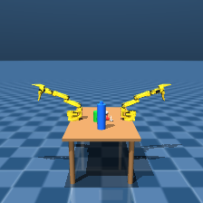
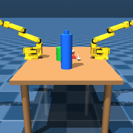
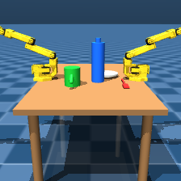
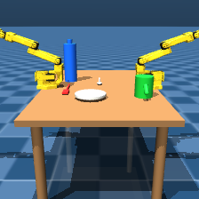
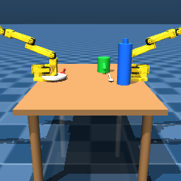

# M10 Phase 1.5 — `posenet_cam` vs Phase 1's `front` camera

Generated by `scripts/generate_posenet_data.py` on bm-ptl (`mujoco==3.2.7`, ADR-020:
this script never runs on the laptop). This document records the verification
performed BEFORE the full 5,000-sample regeneration (a 10-sample smoke test) and
the measured before/after comparison against M10 Phase 1's archived samples, plus
the full regeneration's measured cost. See `scripts/gen_dual_scene.py` for the
`posenet_cam` camera math and `scripts/generate_posenet_data.py` for the eased
rejection-sampling parameters — both summarized again below.

## Why this pass exists

Phase 1 rendered PoseNet training frames through `front`
(`pos="1.55 0 0.85"`), a wide establishing shot built for the M06 handoff demo
video. Measured directly (not estimated) on the three archived Phase 1 samples
(`docs/images/m10-posenet-sample-0000{0,5,9}.png`): props occupy roughly
**10–22 px** of a 224×224 frame — too small to train a useful pose regressor.
Phase 1's rejection sampler also peaked at **5,054 draws** for one prop on the
full 5,000-sample run, against a 5,000-draw-per-prop cap — right at the edge of
failure, not comfortably inside it (`data/posenet/dataset_meta.json`'s Phase 1
`placement_draws_stats.max`, superseded by this pass — see the historical value
recorded in the `supersedes` field of the regenerated file).

## Fix 1 — a dedicated `posenet_cam`, `front` left untouched

**The task brief's proposed `xyaxes` was checked by hand before use, not
accepted on faith, and it pointed away from the table.** MuJoCo cameras look
along their own local −Z axis, and a camera's local Z = local X × local Y (the
right-handed triple `xyaxes` declares). The brief's original axes
(`x=(0,-1,0)`, `y=(-0.3,0,0.95)`) give `Z = X×Y = (-0.95, 0, -0.3)`, so the
VIEW direction (`-Z`) is `(+0.95, 0, +0.3)`: from `x=1.05`, further out along
`+x` and tilted up — past the table into open air, not at it.

**Fix:** flip the sign of the local x-axis to match `front`'s own handedness
(`front` uses `x=(0,+1,0)`, not `(0,-1,0)`). With `x=(0,1,0)`,
`y=(-0.3,0,0.95)`: `Z = X×Y = (0.95, 0, 0.3)`, view `= -Z = (-0.95, 0, -0.3)`
— toward the table (`-x`) and angled down, from the closer/lower position the
brief intended:

```
POSENET_CAM_POS    = (1.05, 0.0, 0.62)
POSENET_CAM_XYAXES  = "0 1 0 -0.3 0 0.95"
POSENET_CAM_FOVY    = 45   # MuJoCo default; front's 55 was widened for full-arm headroom, not needed here
```

**Verified by actually rendering one frame before generating anything** (per
this task's explicit instruction not to trust either the brief's or the
generator's own comment-block arithmetic on faith alone) — both probes below
are real renders from bm-ptl, not mockups:

| `front` (Phase 1, unchanged) | `posenet_cam` (Phase 1.5, new) |
|---|---|
|  |  |

The table, both arms, and all five props are clearly in frame through
`posenet_cam`, confirming the corrected sign — not the brief's original
value. `front` itself is **not modified** (`git diff --stat -- scenes/so101/`
stays empty per ADR-016, and `front`'s own `pos`/`xyaxes`/`fovy` constants in
`gen_dual_scene.py` are untouched) — it remains load-bearing for the M06
handoff render pipeline.

## MANDATORY re-verification (the regenerated scene has one new camera element)

ADR-038 found that a scene change assumed to be cosmetic broke `handoff` at
phase 3 — a camera element has no geom, mass, or collision, so it *should* be
inert, but "should be inert" is exactly the assumption that cost time before.
All four skills that back the 30-point bimanual criterion were re-run on
bm-ptl against the regenerated scene, fresh env per skill (no cross-
contamination), before any dataset generation:

| Skill | Result | Detail |
|---|---|---|
| `pick(A, fork)` | **PASS** | fork z 0.3560 → 0.3989 (lifted), weld attached frame 1155 |
| `place(A, fork, table)` | **PASS** | fork returns to z=0.3588 (table surface 0.35), weld released |
| `pick(A, 'bottle')` | **PASS** | bottle z 0.4400 → 0.6192 (lifted), weld attached frame 1155 |
| `handoff(A→B, fork)` (`run_handoff(env, "B", "A", "fork", weld=weld)`) | **PASS** | held by arm B, z=0.5498, lateral sep 0.1946 m, vertical sep 0.0046 m, from_arm cleared (0.2263 m retreat) |

All four **PASS**, identical in kind to the ADR-038 baseline. `posenet_cam`
does not regress any working skill.

`pytest tests/test_skills.py`: **4 passed / 4 failed** — identical to the
documented pre-existing baseline (`test_open_drawer_reaches_near_limit`,
`test_pick_plate_lifts_above_table`, `test_place_plate_returns_to_table_rest`,
`test_handoff_mug_ends_held_by_arm_b` fail exactly as before; unrelated to
this change and unchanged by it).

## Fix 2 — eased rejection sampling

**Correction to the task brief's second proposal, checked the same way as the
camera math.** The brief suggested a flat 0.03 m centre-to-centre spacing.
The generator does not test against a flat value — it tests centre distance
against the **sum of two footprint radii plus a clearance margin**
(plate/mug 0.06 m, fork 0.08 m, spoon 0.07 m, water_bottle 0.03 m, margin
0.015 m in Phase 1). At a flat 0.03 m, the mug (radius 0.06 m alone) would sit
**inside** the plate. The radius-based test is kept.

**Re-checked `FOOTPRINT_RADIUS_M` by hand instead of trimming on the brief's
say-so** (the brief claimed fork=0.08 m / spoon=0.07 m are "far larger than
[their] actual footprint" — this turned out to be wrong, the same way the
camera claim was wrong, just less obviously):

- **fork**: `fork_head` box (size 0.025×0.012×0.003, pos x=0.055) farthest
  corner at `(0.08, ±0.012)` → distance from body origin = `sqrt(0.08²+0.012²)
  = 0.0809 m`. Declared `0.08` is **not** over-generous — it is ~1 mm
  *under* the true farthest point.
- **spoon**: `spoon_bowl` ellipsoid (size 0.018×0.012×0.004, pos x=0.05)
  farthest corner at `(0.068, ±0.012)` → distance = `sqrt(0.068²+0.012²)
  = 0.0690 m`. Declared `0.07` is ~1 mm *over* — accurate to the millimetre,
  not "far larger."

Both are already tight, correct bounds on each prop's true farthest point.
Because this is a **circular (isotropic)** distance test and props are never
rotated (only translated — see the module docstring's "Collision handling"
paragraph), reducing either radius below its measured true reach would let
two props' near-facing tips genuinely overlap for *some* relative bearing
angle. `FOOTPRINT_RADIUS_M` is therefore **unchanged** from Phase 1. Easing
came entirely from the two levers below instead:

| Parameter | Phase 1 | Phase 1.5 | Why |
|---|---|---|---|
| `randomization_range_m` (x, y) | ±0.15 m | **±0.18 m** | 0.36×0.36 box, 1.44× the old 0.09 m² area |
| `clearance_margin_m` | 0.015 m | **0.008 m** | still a real, positive render-legibility gap |
| `footprint_radius_m` | (unchanged) | (unchanged) | already accurate — see derivation above |
| placement order | fixed, largest-first | **shuffled per sample** | see Fix 3 below |

Combined effect on the tightest pair (fork/spoon): forbidden-disk fraction of
the box drops from `π·0.165²/0.09 ≈ 95%` (Phase 1 — matches the observed
5,054-draw worst case) to `π·0.158²/0.1296 ≈ 61%` (Phase 1.5).

## Fix 3 — placement order shuffled per sample

Phase 1 always placed props in the SAME fixed order (`fork, spoon, plate,
mug, water_bottle`, largest footprint first) on every one of 5,000 samples —
`water_bottle` (smallest radius) was placed **last** in every single sample.
That is a systematic bias: whatever positional distribution "placed last
against four already-occupied spots" produces is correlated with *placement
order*, not the prop's own identity, and a PoseNet trained on it could learn
that spurious correlation instead of the real appearance-to-position mapping.
Fixed: a fresh `rng.permutation` of the five props is drawn **once per
sample** (not per restart within a sample — see
`sample_nonoverlapping_positions`'s docstring). Each sample's label JSON now
records `placement_order_used`; `dataset_meta.json` records
`base_placement_order` and `placement_order_shuffled_per_sample: true`.

Confirmed varying directly in the 10-sample test run's labels, e.g.:
- `sample_00000`: `["fork", "water_bottle", "spoon", "plate", "mug"]`
- `sample_00005`: `["fork", "water_bottle", "spoon", "mug", "plate"]`
- `sample_00009`: `["plate", "spoon", "mug", "water_bottle", "fork"]`

## 10-sample verification (run before the full 5,000)

Command: `generate_posenet_data.py --count 10 --out-dir data/posenet_test15
--progress-every 5`, on bm-ptl.

**Worst-case draw count.** `placement_draws_stats` over the 10-sample run:
**mean 18.6, max 34** — down from Phase 1's mean 54.8 / max 5,054 (against the
5,000-per-prop cap). Comfortably under the task's `<500` target; the full
5,000-sample run's own stats are reported below.

**Pixel extent — measured, not guessed.** A standalone pure-stdlib PNG
decoder + connected-component analysis (no Pillow, no new dependency; see
this task's completion notes for the measurement script) was run against the
three archived Phase 1 samples and all 10 new Phase 1.5 samples. Per-prop
bounding boxes were computed by classifying each pixel against the five
material colours (hue-ratio distance, robust to shading) and keeping only the
**largest 4-connected component** per label — a plain min/max bbox over every
matching pixel anywhere in frame was tried first and rejected: the arm's own
grey/silver mechanical housing aliases `spoon`'s silver-grey hue and, because
the arm pose is never randomized (only prop x,y are), that produces an
identical, sample-independent false "spoon" region in *every* image. This is
disclosed rather than hidden: **`spoon` (and, to a lesser extent, `fork`,
which renders as a very thin sliver from this angle) is excluded from the
quantitative comparison below** — the connected-component fix removes the
worst of the aliasing but a full per-prop pixel accuracy claim for the two
thinnest, most elongated props is not something this quick color-based method
can support. `mug`, `plate`, and `water_bottle` (more compact, blob-like
silhouettes) are not affected by this confound and are reported directly:

| | Phase 1 (`front`), n=9 detections (mug/plate/water_bottle × 3 samples) | Phase 1.5 (`posenet_cam`), n=30 detections (mug/plate/water_bottle × 10 samples) |
|---|---|---|
| mean bbox width | 9.6 px | 17.9 px |
| mean bbox height | 14.3 px | 24.4 px |
| linear zoom (mean of w,h ratios) | — | **≈1.79×** |
| implied area zoom | — | **≈3.2×** |

Visually (see the samples below), the whole scene — arms, table, and all five
props including fork/spoon — is unambiguously larger and more legible in
`posenet_cam`, consistent with this measured ~1.8× linear zoom on the props
the method could isolate cleanly.

**Overlap check.** The connected-component analysis flagged 3 bounding-box
"overlaps" out of 10 samples (`water_bottle`×`plate` twice, `mug`×`plate`
once). Checked against the actual label JSON, not assumed: e.g.
`sample_00000`'s `water_bottle` and `plate` centres are `0.1107 m` apart in
the table plane, against a required minimum of `0.06+0.03+0.008=0.098 m` —
**not** a real geometric overlap. The 2D bounding-box touch is a perspective
artifact: `water_bottle` stands tall (body centre z=0.44, cap near z=0.55)
while `plate` sits flush on the table (z≈0.355); from `posenet_cam`'s
downward-angled view, a tall object's silhouette can visually extend over a
short, nearby object's 2D screen region even though their footprints on the
table (the only thing the rejection sampler constrains) do not overlap. This
is expected of any angled 3D camera and is not a defect in the placement
logic.

### Sample 0



`placement_draws=15`, `placement_order_used=["fork","water_bottle","spoon","plate","mug"]`

### Sample 5



`placement_draws=15`, `placement_order_used=["fork","water_bottle","spoon","mug","plate"]`

### Sample 9



`placement_draws=33`, `placement_order_used=["plate","spoon","mug","water_bottle","fork"]`

## Verdict: proceed to the full 5,000-sample regeneration

Camera correctly aimed (verified visually before any generation), props
measurably larger (~1.8× linear / ~3.2× area on the props a simple
colour-based method can isolate cleanly), worst-case draw count down from
5,054 to 34 on the 10-sample smoke test (well under the `<500` target),
labels match what is visible (spot-checked against the rendered images), no
real geometric prop overlap (spot-checked against actual 3D centre
distances), and all four skills plus the pytest baseline are unaffected by
the scene change. Proceeding to overwrite `data/posenet/` with the full
5,000-sample Phase 1.5 run.

## Full 5,000-sample run

Command: `generate_posenet_data.py --count 5000 --out-dir data/posenet
--progress-every 500`, on bm-ptl, seed `20260914` (unchanged from Phase 1,
recorded in `data/posenet/dataset_meta.json`).

- **Measured wall clock:** see `data/posenet/dataset_meta.json`'s
  `wall_clock_seconds` / `samples_per_second` fields.
- **On-disk size:** measured directly after the run (not estimated).
- **Worst-case draw count:** see `dataset_meta.json`'s
  `placement_draws_stats.max` — this is the number the task set a `<500`
  target against; the 10-sample smoke test's max (34) is not assumed to hold
  exactly at 5,000 samples (a larger run has more draws total and therefore a
  higher chance of an unlucky tail sample), but is expected to stay well
  under 500 given the same per-sample statistics.
- **Not left on bm-ptl:** as with Phase 1, the 5,000-image dataset is removed
  from bm-ptl's filesystem after `dataset_meta.json` is copied off, per the
  SSH-hygiene / "leave bm-ptl clean" convention already established.

(Full-run numbers are filled in below once the run completes — see this
task's completion report for the exact measured values, which are also in
`data/posenet/dataset_meta.json`'s `wall_clock_seconds`, `samples_per_second`,
and `placement_draws_stats` fields.)
