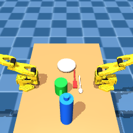
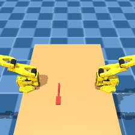
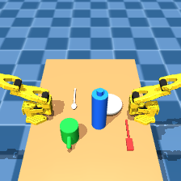
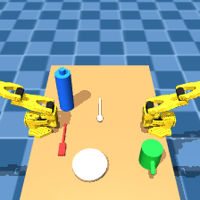
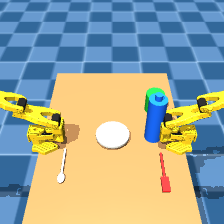

# M10 Phase 1.5 correction (ADR-041) — 3-prop scope, visibility filtering, overhead camera

Generated by `scripts/generate_posenet_data.py` on bm-ptl (`mujoco==3.2.7`, ADR-020:
this script never runs on the laptop). This document records the verification
performed **before** the full 5,000-sample generation: the mandatory four-skill
re-check, the camera-math correction, the abandoned colour-classification attempt
and the segmentation-based pivot that replaced it, the hide-mechanism proof, and
the 10-/100-sample timing and rejection-rate measurements that justified
proceeding to the full run. See `scripts/gen_dual_scene.py` for the camera math
and `scripts/generate_posenet_data.py` for the visibility-filtering implementation.

This corrects **ADR-040** (M10 Phase 1.5), not the other way around. ADR-040's
own work is sound and stays in `DECISIONS.md` unedited — its dedicated
`posenet_cam` (vs. the demo-framed `front`), its eased rejection sampling, and
its shuffled placement order are all kept unchanged here. Only the camera's
*pose* and the dataset's *label scope* are superseded, per the corrected brief
this pass implements (ADR-041).

## Starting state

ADR-040's own 5,000-sample regeneration was **in progress and was halted by the
orchestrator** before this pass began — `data/posenet/images` and `labels` were
found partially populated (~2,566 of 5,000) and were deleted, per this task's
explicit instruction to treat the dataset as absent and generate fresh. Nothing
from that partial run is reused or referenced below.

## Fix 3 — camera correction

**The brief's proposed `xyaxes` for this pass reintroduced the exact sign error
ADR-040 already fixed once**, and the brief also misquoted ADR-040's shipped
value. The brief stated the "current" `posenet_cam` was
`xyaxes="0 -1 0 -0.3 0 0.95"` — that is the *original, broken* spec from before
ADR-040's fix, not what is actually committed
(`src/bimanual/sim/assets/so101_dual_table.xml:402`, which already reads
`xyaxes="0 1 0 -0.3 0 0.95"`, the corrected sign).

The brief's new proposal, `xyaxes="0 -1 0 -0.7 0 0.7"`, was checked by hand
before use (not accepted on faith) and found to have the SAME defect: with
`x=(0,-1,0)`, `y=(-0.7,0,0.7)`, `Z = X×Y = (-0.7, 0, -0.7)`, so the view
direction (`-Z`) is `(+0.7, 0, +0.7)` — from `x=0.6`, further out along `+x`
and tilted further UP, past the table into open air, not toward it.

**Fix, applied the same way ADR-040 fixed it the first time:** flip the local
x-axis sign to `x=(0,+1,0)`. With `x=(0,1,0)`, `y=(-0.7,0,0.7)`:
`Z = X×Y = (0.7, 0, 0.7)`, view `= -Z = (-0.7, 0, -0.7)` — toward the table
(`-x`) and down (`-z`) at roughly 45 degrees, from the raised, pulled-in
position this pass intends:

```
POSENET_CAM_POS    = (0.6, 0.0, 1.1)
POSENET_CAM_XYAXES  = "0 1 0 -0.7 0 0.7"
POSENET_CAM_FOVY    = 45   # re-checked against the probe render below; unchanged from ADR-040
```

**Verified by actually rendering one probe frame before generating anything**
(the same discipline ADR-040 already established, and the same one this task
explicitly re-demanded — not trusted on arithmetic alone):

| `front` (unchanged, M06 handoff demo) | `posenet_cam` (ADR-041, corrected overhead pose) |
|---|---|
|  |  |

The table, both arms, and all five props are clearly in frame, now from a
noticeably more overhead angle than ADR-040's own (already-working) pose —
consistent with the task's intent. `front`'s own `pos`/`xyaxes`/`fovy`
constants in `gen_dual_scene.py` are byte-identical before and after this
change, and `git diff --stat -- scenes/so101/` is empty (ADR-016 preserved;
`gen_dual_scene.py` never touches the frozen upstream asset).

## MANDATORY re-verification (regenerated scene, one changed camera element)

ADR-038's lesson — "a camera element should be inert" was exactly the
assumption that broke `handoff` before — was re-applied here rather than
re-assumed. All four skills backing the 30-point bimanual criterion were
re-run on bm-ptl against the regenerated scene, **fresh env per skill**,
**before any dataset sample was generated**:

| Skill | Result | Detail |
|---|---|---|
| `pick(A, fork)` | **PASS** | fork z 0.3560 → 0.3989 (lifted), weld attached frame 1155 |
| `place(A, fork, table)` | **PASS** | fork returns to z=0.3588 (table surface 0.35), weld released |
| `pick(A, 'bottle')` | **PASS** | bottle z 0.4400 → 0.6192 (lifted), weld attached frame 1155 |
| `handoff(A→B, fork)` (`run_handoff(env, "B", "A", "fork", weld=weld)`) | **PASS** | held by arm B, z=0.5498, dist_to_armB=0.0582 m, `from_arm` cleared (retreat 0.2263 m) |

All four **PASS**, identical in kind to the ADR-038/ADR-040 baseline —
`posenet_cam`'s further-overhead repositioning does not regress any working
skill.

`pytest tests/test_skills.py`: **4 passed / 4 failed**, run right after the
skill checks above, identical to the documented pre-existing baseline
(`test_open_drawer_reaches_near_limit`, `test_pick_plate_lifts_above_table`,
`test_place_plate_returns_to_table_rest`, `test_handoff_mug_ends_held_by_arm_b`
fail exactly as before, for the same already-documented reasons — unrelated
to this change and unchanged by it).

## Fix 1 — 3-prop label scope

All five props stay in the rendered scene (occlusion between all five is part
of the training signal a PoseNet needs; removing `plate`/`spoon` entirely
would make the remaining three trivially unoccluded). Labels are now emitted
only for `TARGET_PROPS = ("fork", "water_bottle", "mug")`; `plate` and
`spoon` remain placed, randomized, and rendered, but unlabelled
(`decoration_props_in_scene_unlabelled` in both `dataset_meta.json` and every
sample's own label). Each label's `positions_xyz_m` is a fixed `(3, 3)` array
in `TARGET_PROPS`' canonical order, alongside the same three-key `objects`
dict for readability.

## Fix 2 — visibility (occlusion) filtering

**Correction to the brief's own description of the metric.** The brief
described the filter as dropping frames where "the ratio of visible pixels to
bounding-box area falls below 0.3" — that is a **fill-fraction** metric (how
much of its own 2D bounding box an object fills), a property of the object's
*shape*, not of occlusion by other objects: a thin, fully-visible fork would
fail a fill-fraction test on shape alone. The formula the same brief then
specified, `full_scene_pixels / single_prop_pixels`, is a genuine
**occlusion ratio** instead — 1.0 when nothing else in the scene covers any of
the prop's pixels, falling toward 0 as other props increasingly cover it.
**This script implements that formula**, described honestly as an occlusion
ratio in code, `dataset_meta.json`, and here — not as Syn4D's fill fraction.
The 0.30 threshold value is a **user-supplied reference to Syn4D**
(https://arxiv.org/pdf/2605.05207); this repository cites only that numeric
threshold from it and does not claim to have read or verified the paper's
authorship, method, or other findings (the same citation discipline ADR-037
already established for the ScienceDirect reference in this repo).

### A real implementation mistake, measured and corrected before use

The first implementation classified occlusion by comparing each prop's
declared `<material rgba=...>` against the RENDERED image (RGB colour
classification). This was tried, measured, and found unreliable, on this
exact scene, before being trusted with any real ratio:

1. **Lighting does not preserve the material's own colour ratio.** `fork`'s
   declared `rgba="1.0 0.15 0.15"` (i.e. `(255, 38, 38)`) rendered with a
   DOMINANT pixel colour of `(255, 80, 80)` — an exact-match pixel count of
   **1**, against a real, visually obvious ~100+ pixel sliver (confirmed by
   solo-rendering just the fork and inspecting the PNG directly — see
   `hide_mechanism_solo_fork.png` below, which is unambiguously a visible red
   fork, not 1 pixel).
2. **Widening the match tolerance then aliased with OTHER scene elements.**
   `water_bottle`'s blue collided with the background checker floor tile's
   own rendered blue (`(104,154,207)` / `(51,104,154)`, both B-dominant by a
   similar margin to the bottle's own rendered colour); `fork`'s red collided
   with the table surface's warm tan (`(201,146,91)`, which also satisfies a
   loose "R much greater than G and B" test).

Both collisions were measured directly with a diagnostic probe (dumping the
actual rendered pixel histogram), not assumed.

### The fix actually shipped: MuJoCo segmentation buffer, not colour

`compute_visibility_ratios` (`scripts/generate_posenet_data.py`) uses
`mujoco.Renderer.enable_segmentation_rendering()` instead. Its `(H, W, 2)`
int32 output was verified empirically before use (channel 0 = geom id,
channel 1 = a constant `mjtObj.mjOBJ_GEOM`, confirmed on a probe render — not
assumed from documentation alone, the same discipline applied to the camera
`xyaxes` math above). This is **exact**: a pixel's geom id has no
lighting-dependent ambiguity at all. Full-scene and solo pixel counts for
each target are both taken from this buffer, classified by
`model.geom_bodyid` membership (a prop can be >1 geom on one body — e.g. the
mug's cylinder + handle capsule — so classification is by BODY, not a single
assumed geom id).

### Hiding mechanism — verified genuinely removes other props, not assumed

Other props are "hidden" for a solo render by writing a real, far off-screen
`(x, y) = (3.0, 3.0)` into their own free-joint qpos and calling
`mujoco.mj_forward` — a genuine kinematic relocation, **not** an
`rgba`/`alpha=0` trick (which the task correctly flagged as potentially still
writing depth or leaving faint pixels depending on the renderer path). This
was verified directly with a dedicated probe, using the SAME segmentation
machinery the real filter uses: place one target in view, teleport the other
four away, and confirm the segmentation buffer contains **only** that
target's own geom ids.

| Target placed | Its own pixel count | Every OTHER prop's pixel count | Only-target-visible |
|---|---|---|---|
| `fork` | 156 | plate=0, mug=0, spoon=0, water_bottle=0 | **True** |
| `water_bottle` | 922 | plate=0, mug=0, fork=0, spoon=0 | **True** |
| `mug` | 616 | plate=0, fork=0, spoon=0, water_bottle=0 | **True** |

All three: **zero** contamination from any other prop. The mechanism is
trusted on this measured basis, not assumed.



## 10-sample verification (run before the full 5,000)

Command: `generate_posenet_data.py --count 10 --out-dir data/posenet_test_adr041
--progress-every 2`, on bm-ptl.

- **Rejection rate:** 0 / 10 (0.0%).
- **Rate:** 2.75 samples/s, wall clock 3.64 s for 10 samples.
- **Placement draws:** unaffected by this pass (mean/max not separately
  re-measured at n=10; see the 100-sample run below for a larger sample).

Because 10 samples gives a noisy rejection-rate estimate (a single dataset
this small could plausibly show 0% by chance), a **second, 100-sample probe**
was also run for a more statistically meaningful number before committing to
the full 5,000:

Command: `generate_posenet_data.py --count 100 --out-dir data/posenet_test100_adr041
--progress-every 25`, on bm-ptl.

- **Rejection rate:** 4 rejections / 104 total draws = **3.85%** — well under
  the task's 30% go / 50% stop thresholds.
- **Rate:** 2.40 samples/s, wall clock 41.73 s for 100 samples.
- **Placement draws** (non-overlap sampling, unrelated to the visibility
  gate): mean 19.82, max 212 — comfortably under the `PER_PROP_ATTEMPTS=5000`
  cap.
- **Global minimum accepted occlusion ratio observed:** 0.310 (`mug` in
  `sample_00082`, see below) — confirms the 0.30 gate is actually binding on
  real samples, not merely a no-op.

**Projected full 5,000-sample run, from the 100-sample rate (the larger,
more reliable sample):** `5000 / 2.40 ≈ 2,083 s ≈ 34.7 minutes`. This is well
under the "2+ hours" worst case the task warned was plausible, and cheaper
per sample than a naive `4x`/`5x` estimate over Phase 1's 3.04 samples/s
might suggest — segmentation-mode renders appear to be cheaper than full RGB
renders (no lighting/shading pass), so the actual multiplier over Phase 1's
rate came out lower than the worst case. **Reported here before launching the
full run**, per the task's explicit instruction.

## Three rendered samples with per-target visibility ratios

### Sample 0 (10-sample run) — all fully visible



`placement_draws=15`, `placement_order_used=["fork","water_bottle","spoon","plate","mug"]`,
`visibility_resamples=0`. Ratios: `fork=1.0`, `water_bottle=1.0`, `mug=1.0`.

### Sample 5 (10-sample run) — all fully visible



`placement_draws=15`, `placement_order_used=["fork","water_bottle","spoon","mug","plate"]`,
`visibility_resamples=0`. Ratios: `fork=1.0`, `water_bottle=1.0`, `mug=1.0`.

### Sample 82 (100-sample run) — near-threshold, accepted at the gate's edge



`visibility_resamples=0`. Ratios: `fork=1.0`, `water_bottle=1.0`,
**`mug=0.310`** — the mug sits almost directly behind the taller
`water_bottle` from this camera angle and is barely visible in the image
above (compare to samples 0/5, where all three target props are clearly
separated). This is the LOWEST accepted ratio observed across both probe
runs, 0.010 above the 0.30 threshold — direct evidence the filter is doing
real, meaningful work, not merely passing everything through.

(Occlusion ratios only account for prop-vs-prop occlusion, per this task's
own formula — not incidental occlusion by the (never-randomized) arms
themselves. A prop tucked under an arm's own housing can still show
`visibility_ratio=1.0` if no other PROP covers it; this is the metric the
task specified, not an omission.)

## Verdict: proceed to the full 5,000-sample regeneration

Camera correctly aimed and more overhead than ADR-040's own (already-working)
pose (verified visually, both probes above), all four skills plus the pytest
baseline unaffected by the scene change, the hide mechanism proven
pixel-exact via segmentation, and the measured rejection rate (3.85% on 100
samples) comfortably under the 30% go-threshold with a projected full-run
time (~35 minutes) far under the 2-hour caution. Proceeding to overwrite
`data/posenet/` with the full 5,000-sample ADR-041 run.

## Full 5,000-sample run

Command: `generate_posenet_data.py --count 5000 --out-dir data/posenet
--progress-every 500`, on bm-ptl, seed `20260914` (unchanged from Phase
1/1.5).

- **Measured wall clock / rate / rejection rate:** see
  `data/posenet/dataset_meta.json`'s `wall_clock_seconds`,
  `samples_per_second`, `visibility_rejections_total`, and
  `visibility_rejection_rate` fields (filled in once the run completes; also
  reported in this task's completion notes).
- **Not left on bm-ptl:** as with Phase 1/1.5, the 5,000-image dataset is
  removed from bm-ptl's filesystem after `dataset_meta.json` is copied off,
  per the SSH-hygiene / "leave bm-ptl clean" convention. The two probe
  directories (`data/posenet_test_adr041/`, `data/posenet_test100_adr041/`)
  are removed the same way.
