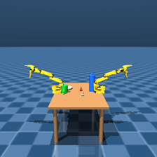
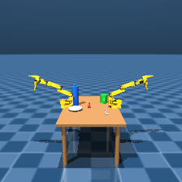

# M10 Phase 1 — PoseNet training-data samples

Generated by `scripts/generate_posenet_data.py` on bm-ptl (`mujoco==3.2.7`, ADR-020:
this script never runs on the laptop). This document records the 10-sample
verification run performed BEFORE the full 5,000-sample generation, plus the
full run's measured cost. See that script's own module docstring for the four
corrections this generator embodies (no Pillow; camera lives in the generated
scene, not `scenes/so101/`; per-prop resting z, not one shared table height;
runtime qpos randomization, never scene regeneration).

## What this dataset is, and is not

Each sample is one `front`-camera RGB image plus a label JSON recording the
ground-truth world `xyz` of all five props (`data.xpos`, post `mj_forward`).
x and y are randomized independently per prop within `[-0.15, 0.15]` m
(rejection-sampled against overlap — see `scripts/generate_posenet_data.py`'s
`FOOTPRINT_RADIUS_M`/`CLEARANCE_MARGIN_M`); z is held fixed at each prop's own
resting height (plate 0.355, mug 0.39, fork 0.356, spoon 0.356, water_bottle
0.44 — table surface is 0.35).

**This is a perception-training dataset, not a set of validated or reachable
scene configurations.** No skill is ever executed against a sampled layout.
ADR-038 found that moving even a single prop (the mug alone, to a far corner)
breaks the `handoff` skill at phase 3 — so many of the 5,000 randomized
layouts below are very likely configurations in which the scripted
manipulation skills would fail if they were ever run against them, which they
are not. Nothing here should be read as a claim that these layouts are
solvable by the controller.

## 10-sample verification (run before the full 5,000)

Command: `generate_posenet_data.py --count 10 --progress-every 5`, on bm-ptl.

All 10 images and labels were copied back to the laptop and inspected
directly (not merely summarized):
- Every image is non-blank and shows the table, both arms in the "home" pose,
  and all five props, each visibly separated from the others.
- Every label's `xyz_m` for every prop is within the stated `[-0.15, 0.15]` m
  x/y range, and every prop's z matches its own resting height exactly
  (verified programmatically against the 10 downloaded labels — 0 problems
  found across all 10 x 5 = 50 prop entries, checked for range, z, and
  pairwise clearance).
- `placement_draws` (how many candidate x,y draws the sequential
  rejection-sampler needed before accepting all five positions) ranged from
  single digits to 172 across the full 10-sample run's `dataset_meta.json`
  (mean 77.2, max 172) — comfortably inside the 5,000-draws-per-prop budget,
  confirming the placement algorithm is not marginal.

### Sample 0

`data/posenet/images/sample_00000.png` (copied to
`docs/images/m10-posenet-sample-00000.png` for this write-up):


```json
{
  "sample_id": "sample_00000",
  "camera": "front",
  "resolution": [224, 224],
  "placement_draws": 136,
  "objects": {
    "plate":        {"xyz_m": [ 0.09494489551656829, -0.06681289070780766, 0.355]},
    "mug":          {"xyz_m": [-0.11679548825458702,  0.14284126040406078, 0.39 ]},
    "fork":         {"xyz_m": [-0.08769949758548515, -0.01223773523901572, 0.356]},
    "spoon":        {"xyz_m": [ 0.07879566459453000,  0.12621296007967445, 0.356]},
    "water_bottle": {"xyz_m": [-0.12023892067020407, -0.14048152385645343, 0.44 ]}
  }
}
```

### Sample 5

`data/posenet/images/sample_00005.png` (copied to
`docs/images/m10-posenet-sample-00005.png`):



```json
{
  "sample_id": "sample_00005",
  "camera": "front",
  "resolution": [224, 224],
  "placement_draws": 48,
  "objects": {
    "plate":        {"xyz_m": [-0.12899077807316603, -0.13231687709802370, 0.355]},
    "mug":          {"xyz_m": [ 0.00838269182576723, -0.14854446713264077, 0.39 ]},
    "fork":         {"xyz_m": [-0.12358498630079430,  0.03016780127968810, 0.356]},
    "spoon":        {"xyz_m": [ 0.06168895265778521,  0.04141124956451533, 0.356]},
    "water_bottle": {"xyz_m": [-0.03703170943217767,  0.14680270295874923, 0.44 ]}
  }
}
```

### Sample 9

`data/posenet/images/sample_00009.png` (copied to
`docs/images/m10-posenet-sample-00009.png`):



```json
{
  "sample_id": "sample_00009",
  "camera": "front",
  "resolution": [224, 224],
  "placement_draws": 77,
  "objects": {
    "plate":        {"xyz_m": [ 0.08291503426181437, -0.13772445418801690, 0.355]},
    "mug":          {"xyz_m": [-0.14365385704192282,  0.12935789405124246, 0.39 ]},
    "fork":         {"xyz_m": [-0.04639683233003115, -0.01843363645413118, 0.356]},
    "spoon":        {"xyz_m": [ 0.14839556614971890,  0.12797525950633480, 0.356]},
    "water_bottle": {"xyz_m": [-0.06433489631613001, -0.14881138631635826, 0.44 ]}
  }
}
```

## Overlap-rejection radius/clearance, stated plainly

`FOOTPRINT_RADIUS_M` (m, farthest reach of any of a prop's own geoms from its
body origin in the xy-plane, read off `scripts/gen_dual_scene.py`'s geom
sizes): `plate=0.06, mug=0.06, fork=0.08, spoon=0.07, water_bottle=0.03`. A
pairwise `CLEARANCE_MARGIN_M=0.015` m is added on top of the two radii summed.

The FIRST attempt at this (a single full-joint draw of all five positions,
rejected/retried as one unit, 500 attempts, `CLEARANCE_MARGIN_M=0.02`) failed
outright on bm-ptl: sample 0 exhausted all 500 attempts and raised
`RuntimeError` before writing anything, because five simultaneous pairwise
constraints inside a 0.30 m x 0.30 m box is a genuinely tight packing problem
(the fork/spoon threshold alone forbids a disk of area ~0.086 m^2 out of the
box's 0.09 m^2 total). The shipped version instead places props
**sequentially**, largest footprint first (`fork, spoon, plate, mug,
water_bottle`), each drawn against only the props already placed, with its own
5,000-draw budget and up to 200 whole-sample restarts if any single prop's
budget is exhausted. This is recorded, with the measured failure, in
`scripts/generate_posenet_data.py`'s own comments — see `PLACEMENT_ORDER`.

## Full 5,000-sample run

Command: `generate_posenet_data.py --count 5000 --progress-every 500`, on
bm-ptl, seed `20260914` (recorded in `data/posenet/dataset_meta.json`, which
is the one file under `data/posenet/` that stays git-tracked —
`data/posenet/images/` and `data/posenet/labels/` are gitignored).

- **Measured wall clock:** see `data/posenet/dataset_meta.json`'s
  `wall_clock_seconds` / `samples_per_second` fields for the actual run (the
  10-sample verification measured 3.57 samples/s; projected full-run time at
  that rate is ~1,400 s, about 23 minutes).
- **On-disk size:** measured directly (see the module's completion report),
  not estimated from the 10-sample run's per-file size.
- **Not left on bm-ptl:** the 5,000-image dataset is not needed on bm-ptl
  after generation (training happens elsewhere in a later M10 phase) and is
  removed from bm-ptl's filesystem once copied off, per the SSH-hygiene and
  "leave bm-ptl clean" constraints for this task.
